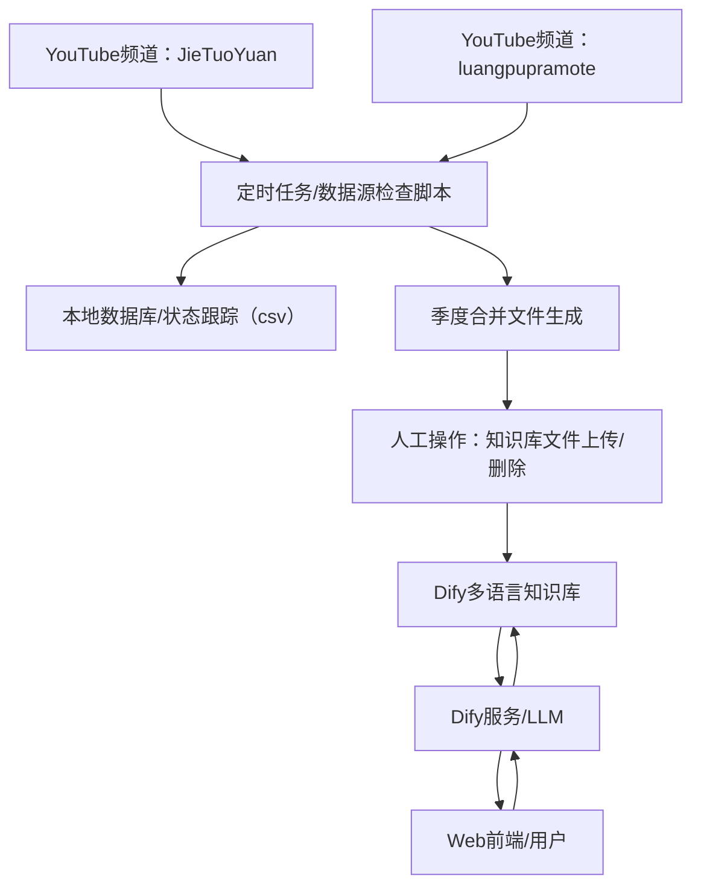

# 文档导航

- [架构总览（本页）](architect.md)
- [详细设计与实现](design.md)
- [部署视角](deployment.md)

# 1. 项目背景

本项目旨在构建一个支持多语言（中文、英文、泰文）的视频字幕知识库检索与对话系统，适用于隆波帕默尊者禅修、佛教哲学等佛学视频内容。系统需支持多语言字幕独立建库，用户提问时自动识别语言并路由到对应知识库，统一用提问语言回答。

# 2. 系统整体架构

## 2.1 架构总览图

> 注：人工操作节点明确标注，数据流和服务流清晰分层。

## 2.2 系统边界与外部依赖

本系统依赖于外部的两个 YouTube 频道作为知识库采样来源：
- **YouTube频道：JieTuoYuan**（https://www.youtube.com/@JieTuoYuan）
- **YouTube频道：luangpupramote**（https://www.youtube.com/@luangpupramote）

这两个频道属于系统边界之外的外部组件，tools 脚本定期采样其视频和字幕数据，作为知识库构建的原始数据来源。

## 2.3 主要子系统概览
- **数据采集与处理**：tools 脚本定期采样外部视频和字幕，生成结构化数据。
- **知识库服务**：多语言知识库独立管理，支持高效检索。
- **Dify 集成**：利用 Dify 平台 workflow 和知识库能力，统一问答生成。
- **Web 前端**：用户交互界面，通过环境变量与 Dify 平台集成。

# 3. 子系统详细说明

## 3.1 数据采集与处理
- tools 脚本采样外部 YouTube 频道，下载视频及字幕。
- 数据清洗、分段、结构化存储（如 JSON/SQLite）。
- 定时任务与人工操作结合，保证数据完整性。

## 3.2 知识库服务与结构
- 多语言知识库独立建库，按语言分库检索。
- 文档命名规范：`<视频标题>_<视频ID>_<语言后缀>.txt`。
- 知识库参数建议：embedding_model、chunk_size、retrieval_settings 等。

## 3.3 Dify 工作流与集成

Dify 平台在本系统中承担了“多语言知识库检索与智能问答”的核心角色。其内部工作流主要包括以下关键节点：

1. 用户输入问题，触发工作流。
2. 通过自定义 Python 代码节点自动检测输入语言（支持中/英/泰）。
3. 问题分类器判断问题类型（修行相关、问候、其它）。
4. 条件分支根据语言和问题类型，分流到对应知识库检索或直接回复。
5. 检索对应语言的知识库，top_k=10，返回相关段落。
6. 汇总检索结果，传递给 LLM 节点。
7. LLM 节点根据 Prompt 模板生成结构化答案（AI 总结+原文段落+视频链接等）。
8. 输出最终答案。

> 其中“语言检测与路由”作为 Dify 工作流的一个节点实现，不再单独成节。
> 详细流程节点、参数配置和 Prompt 模板见 [design.md](design.md)。

## 3.4 Web 前端集成
- 通过 3 个环境变量与 Dify 平台集成：
  - `NEXT_PUBLIC_APP_ID`：Dify 平台应用的 App ID
  - `NEXT_PUBLIC_APP_KEY`：Dify 平台应用的 API Key
  - `NEXT_PUBLIC_API_URL`：Dify 平台 API 的访问地址
- 这些变量在 web/config/index.ts 中被读取，用于初始化与 Dify 的连接。

# 4. 实施步骤与架构特点

## 4.1 实施步骤
1. 创建 3 个知识库，配置 embedding 和检索参数。
2. 按字幕语言分发视频文档入库。
3. 配置 Workflow：语言检测、条件分支、知识库检索、LLM 生成。
4. 测试各语言流程，优化参数和提示词。

## 4.2 架构特点
- 结构清晰：一对一语言-知识库映射，便于理解和维护。
- 独立性强：各知识库独立管理，互不影响。
- 检索高效：每次仅针对单一知识库进行检索，响应速度快。
- 易于扩展：可根据需要增加新的语言知识库。
- 用户体验一致：用户提问和系统回答均保持同一语言，交互自然。
- 适配 Dify：充分利用 Dify 的 workflow 和知识库能力，便于集成和运维。
