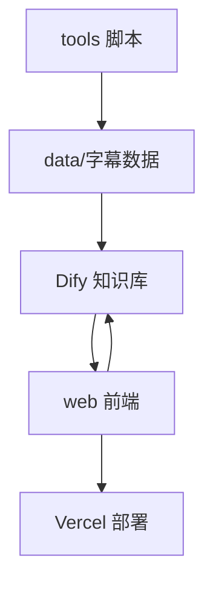

# 部署视角

本节描述 video-chat-transcript 项目的各组件部署方式、依赖环境、配置管理与上线流程。

## 1. 目录与组件部署概览
- **tools/**：本地/服务器运行的后台脚本，需 Python 环境。
- **data/**：字幕数据文件，供知识库和前端使用。
- **web/**：前端应用，推荐部署在 Vercel。
- **cloud/**：Dify 平台相关流程与知识库，需在 Dify 云服务配置。
- **vercel/**：Vercel 平台相关配置。

## 2. 环境依赖
- Python >= 3.8（tools 脚本）
- Node.js >= 16（web 前端）
- Dify 云服务账号与知识库配置
- Vercel 账号与部署权限

## 3. 配置与密钥管理
- 敏感信息（API Key、数据库密码等）**不得提交到仓库**。
- 本地开发用 .env 文件管理环境变量。
- 生产环境密钥由运维在 Vercel、Dify 后台配置。

## 4. 各组件部署流程
### 4.1 tools 脚本
- 安装依赖：`pip install -r requirements.txt`
- 运行脚本：`python tools/xxx.py`
- 定时任务可用 crontab 配置。

### 4.2 web 前端
- 本地开发：`cd web && npm install && npm run dev`
- 部署到 Vercel：推送到 GitHub，Vercel 自动构建并自动发布前端，无需手动操作。
- 环境变量在 Vercel 后台配置。

### 4.3 cloud（Dify）
- 在 Dify 平台创建知识库、配置工作流。
- 上传合并后的字幕数据。
- 配置 API Key、回调地址等。

## 5. 部署流程图

## 6. 生产与测试环境说明
- 生产环境：Vercel、Dify 云服务，正式数据与密钥。
- 测试环境：本地或独立测试账号，测试数据与密钥。

## 7. 变更与回滚
- 重要变更需提前备份数据与配置。
- 支持通过 Git/Vercel 回滚前端版本。
- Dify 知识库支持版本管理与回滚。 

## 8. Web 前端 Dify 环境变量说明

| 变量名                 | 说明                     | 示例值                      |
|------------------------|--------------------------|-----------------------------|
| NEXT_PUBLIC_APP_ID     | Dify 应用 App ID         | app-xxxxxxxxxxxxxxxxxxxx    |
| NEXT_PUBLIC_APP_KEY    | Dify 应用 API Key        | api-xxxxxxxxxxxxxxxxxxxx    |
| NEXT_PUBLIC_API_URL    | Dify API 访问地址        | https://api.dify.ai/v1      |

这些变量需在本地 .env.local 或 Vercel 项目环境变量中配置，web 前端通过它们与 Dify 平台集成。 

## 9. 团队协作与平台账号管理

- **GitHub 仓库**：项目代码托管于 [https://github.com/brucezhao1875/video-chat-transcript](https://github.com/brucezhao1875/video-chat-transcript)，需将团队成员邀请为协作者以便协作开发和管理。
- **Vercel 部署**：前端项目部署在 [https://vercel.com/zhaochaohuas-projects/video-chat-transcript](https://vercel.com/zhaochaohuas-projects/video-chat-transcript)。当前为 Vercel Hobby 版，无法创建团队（Team），仅支持个人账号下的协作，团队协作和权限管理有限。
- **Dify 平台**：当前使用 Dify 免费模式，仅支持个人模式，无法实现团队成员协作。现有 cloud.dify.ai 登录账号为 zhaochaohua@gmail.com 创建，后续将新申请一个公共开发用账号，便于团队成员共同管理知识库和流程。

> 如需加入团队、获取权限或有账号安全相关问题，请联系项目负责人。 

## 10. 自定义域名绑定与 DNS 配置

Vercel 分配的域名 `video-chat-transcript.vercel.app` 如果要更简洁的访问域名，需要做域名绑定。以绑定到自定义域名 `t.zhaoch.net` 为例，操作流程如下：

### 10.1 在 Vercel 添加自定义域名并验证所有权
1. 登录 Vercel 控制台，进入对应项目，选择 Settings → Domains。
2. 添加自定义域名（如 `t.zhaoch.net`）。
3. 首次绑定主域名（如 `zhaoch.net`）时，Vercel 会要求在你的域名服务商后台添加一条 TXT 记录（名称为 `_vercel`，值为 Vercel 提供的字符串）。
4. 该 TXT 记录的作用是**防止域名劫持，并确认你拥有对 zhaoch.net 的所有权**。Vercel 通过 DNS 查询验证你是否有权限管理该域名。
5. 域名所有权验证通过后，Vercel 会自动为你的域名配置 HTTPS 证书。

### 10.2 在域名服务商后台配置 DNS 解析
1. 登录你的域名服务商后台，找到 `t.zhaoch.net` 的 DNS 设置。
2. 添加一条 CNAME 记录：
   - 主机记录/子域名：`t`
   - 记录类型：CNAME
   - 记录值：`video-chat-transcript.vercel.app`
3. 保存并等待 DNS 生效（通常几分钟到几小时）。

### 10.3 注意事项
- 主域名（如 `zhaoch.net`）的 TXT 验证只需做一次，后续添加子域名无需重复验证。
- `zhaoch.net` 仅为演示环境时的域名，实际投入使用时我们要申请一个更符合本主题的的域名。
- 域名所有权验证和 CNAME 配置完成后，即可通过自定义域名访问你的 Vercel 项目。 