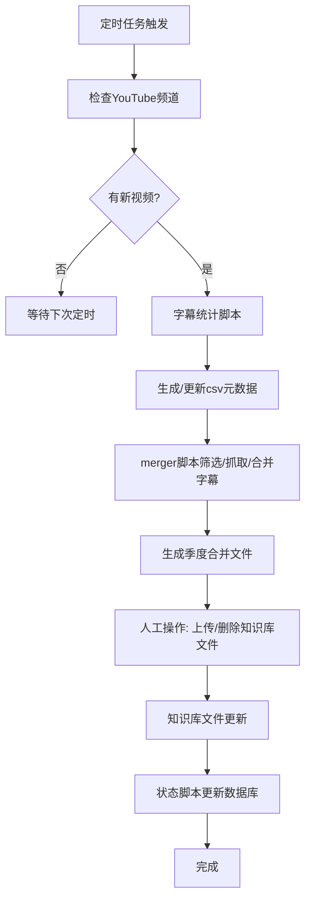

# 设计文档

## 1. 设计目标与范围
### 1.1 设计目标
- 构建一个支持隆波帕默尊者佛学视频多语言字幕的语义检索与对话系统。
- 支持视频与字幕的自动采集、处理、知识库构建与多语言问答。
- 系统应具备高可扩展性、易维护性和良好用户体验。

### 1.2 设计范围
- 后端核心流程与模块设计，不涉及前端UI细节。
- 包含知识库管理、字幕处理、检索、问答、语言检测等关键环节。

### 1.3 与架构文档的关系
- 本设计文档细化架构文档中的各模块实现细节与流程。

## 2. 系统整体设计

### 2.1 总体架构描述
- 系统分为三个主要子系统：
  1. 视频与字幕管理子系统
  2. Dify子系统（知识库管理与服务流程）
  3. 问答响应子系统（video-chat-transcript/web/）
- 各子系统协同实现从视频采集、字幕处理、知识库构建到多语言问答的完整闭环。

### 2.2 主要模块划分与职责
- **视频与字幕管理子系统**：视频与字幕上传、解析、标准化、分发入库。
- **Dify子系统**：知识库管理、服务流程（语言检测、检索、LLM问答生成）。
- **问答响应子系统**：Web服务与用户交互，调用Dify服务。

### 2.3 数据整合与知识库更新策略
- 按季度、按数据源合并字幕，生成合并数据文件。
- 合并文件包含元数据索引，便于检索和管理。
- 升级时先删除旧文件再上传新文件，确保一致性。

### 2.4 数据源跟踪与状态管理
- 使用csv文件跟踪每个视频的处理状态、字幕类型、归属季度等。
- 支持定期备份、数据清理、状态监控。

### 2.5 字幕统计与元数据生成模块
- 负责批量扫描数据源视频，远程检测每个视频的可用字幕语言。
- 生成/更新带有`subtitle`字段的csv元数据文件（如`ds_jietuoyuan.csv`），内容如`zh,en,th`。
- 作为后续字幕合并与知识库入库的基础数据准备环节。

---

## 3. 核心流程设计

### 3.1 视频与字幕入库流程
#### 3.1.1 数据源检查流程
1. **运行字幕统计脚本**
   - 对所有视频批量检测可用字幕类型，生成/更新csv元数据文件，包含`subtitle`字段。
2. **merger脚本处理**
   - merger脚本直接读取csv的`subtitle`字段，判断是否有目标语言字幕，无需再远程API检测。
   - 只处理`subtitle`字段包含目标语言的视频。

#### 3.1.2 季度文件处理流程
- merger脚本根据`subtitle`字段筛选视频，抓取字幕并合并，无需再逐个检测字幕类型。
- 合并文件按季度、数据源、语言命名，包含元数据。
- 升级时先删除旧文件再上传新文件。

#### 3.1.3 视频与字幕处理详细流程图


### 3.2 用户提问与答案生成流程
1. 用户通过Web前端输入问题，转发至Dify服务。
2. 自动检测用户提问语言，选择对应知识库。
3. 在知识库中检索相关字幕片段，提取上下文。
4. 调用LLM生成答案，返回前端。

### 3.3 异常处理流程
- 数据源异常、字幕获取失败、文件合并失败、知识库更新失败、服务异常等，均有日志与状态跟踪。

---

## 4. 关键技术方案
- 语言检测：基于字符统计或现有库实现。
- 知识库检索：按语言分库，单库检索。
- LLM节点与多语言Prompt：按用户语言动态选择Prompt模板。
- SQLite状态跟踪：记录每个视频处理状态。

---

## 5. 数据结构与接口设计
- 视频元数据结构：video_id、title、url、subtitle、处理状态等。
- 合并数据文件结构：仿csv，含text、video_url、start_time_seconds、speaker。
- 追踪表结构：video_id、lang、merged_file、processed_time。
- 主要接口：字幕统计、字幕合并、知识库更新、状态查询等。

---


## 6. 后续优化与扩展建议
- 支持更多语言和数据源。
- 合并文件并发处理、断点续传优化。
- 更智能的字幕分块与语义聚合。
- 自动化知识库文件上传与管理。

### 3.2 Dify 子系统

- 知识库管理、服务流程（语言检测、检索、LLM问答生成）。
- 主要负责多语言知识库的检索与智能问答。

#### 3.2.1 Dify 工作流详细设计

本节详细描述 Dify 工作流的各个节点、参数配置、Prompt 模板和自定义代码逻辑。

##### 1. 语言检测节点（DETECT_LANG）
- 类型：自定义 Python 代码
- 逻辑：统计输入文本中中/英/泰字符占比，阈值 30%，输出 zh/th/en
- 代码片段：
```python
import re

def main(query: str) -> dict:
    if not query or not query.strip():
        return {'result': 'en'}
    chinese_pattern = re.compile(r'[\u4e00-\u9fff\u3400-\u4dbf\uf900-\ufaff]')
    thai_pattern = re.compile(r'[\u0e00-\u0e7f]')
    english_pattern = re.compile(r'[a-zA-Z]')
    cleaned_text = re.sub(r'[\s\d\W]', '', query)
    if not cleaned_text:
        return {'result': 'en'}
    chinese_count = len(chinese_pattern.findall(cleaned_text))
    thai_count = len(thai_pattern.findall(cleaned_text))
    english_count = len(english_pattern.findall(cleaned_text))
    total_chars = len(cleaned_text)
    zh_ratio = chinese_count / total_chars
    th_ratio = thai_count / total_chars
    en_ratio = english_count / total_chars
    threshold = 0.3
    if zh_ratio >= threshold:
        return {'result': 'zh'}
    elif th_ratio >= threshold:
        return {'result': 'th'}
    elif en_ratio >= threshold:
        return {'result': 'en'}
    else:
        if chinese_count >= thai_count and chinese_count >= english_count:
            return {'result': 'zh'}
        elif thai_count >= english_count:
            return {'result': 'th'}
        else:
            return {'result': 'en'}
```

##### 2. 问题分类器（question-classifier）
- 类型：question-classifier
- 用于区分“修行相关问题”“问候/其它问题”
- 不同类型走不同分支，非修行问题直接 LLM 简短回复

##### 3. 条件分支（if-else）
- 按语言分流到不同知识库检索节点

##### 4. 知识库检索（knowledge-retrieval）
- 三个知识库节点（KB_ZH、KB_TH、KB_EN）
- 检索参数：top_k=10，embedding_model=text-embedding-3-large
- 支持多条结果返回

##### 5. 知识库汇总（variable-aggregator）
- 汇总多路检索结果，统一传递给 LLM

##### 6. LLM 节点
- 主 LLM 节点：deepseek-chat
- Prompt 模板：详见 YAML，包含 AI 总结、原文段落、视频链接等结构化输出要求
- 语言风格、输出结构、润色要求等均有详细规范

##### 7. Answer 节点
- 输出最终结构化答案
